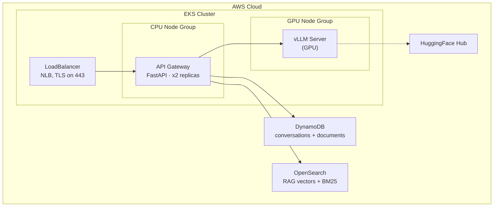

# vLLM on AWS EKS with Conversation Memory and RAG

Deploy HuggingFace LLMs with vLLM on AWS EKS. A FastAPI gateway adds DynamoDB sessions and an OpenSearch RAG knowledge base.

Put knowledge-base files (markdown, PDF, TXT, CSV) in the repo-root [`docs/`](docs/) directory, set `DESIRED_RAG_TOPIC` to match, then index with `./scripts/upload-docs.sh`.

## Stack

- **Orchestration:** Kubernetes on Amazon EKS, Docker, Amazon ECR
- **Compute:** CPU + GPU node groups (default `g5.xlarge` / NVIDIA A10G)
- **Networking / IAM:** Network Load Balancer (TLS via ACM), AWS Load Balancer Controller, IRSA
- **Inference:** vLLM, Hugging Face Hub
- **Gateway:** FastAPI, Uvicorn, Pydantic
- **Data:** Amazon DynamoDB (sessions + document metadata), Amazon OpenSearch (Faiss kNN + BM25)
- **RAG models:** fastembed — `BAAI/bge-small-en-v1.5` embedder, `Xenova/ms-marco-MiniLM-L-6-v2` reranker
- **Optional:** OpenAI gpt-4o-mini + LangChain (input guard and query rewrite)

**Docs**

- [QUICKSTART.md](QUICKSTART.md) — deploy from scratch
- [CHAT_API.md](CHAT_API.md) — client integration (sessions, auth, request shapes)
- [gateway/RAG_ARCHITECTURE.md](gateway/RAG_ARCHITECTURE.md) — RAG pipeline
- [gateway/README.md](gateway/README.md) — gateway service
- [scripts/commands.md](scripts/commands.md) — kubectl / AWS cheat sheet

**Defaults:** `meta-llama/Llama-3.1-8B-Instruct` on `g5.xlarge` (~$1/hr) + DynamoDB + OpenSearch Faiss (~$26/month). Embedder `BAAI/bge-small-en-v1.5` and reranker `Xenova/ms-marco-MiniLM-L-6-v2` run in the gateway (CPU). Llama 3.1 is gated — [accept the license](https://huggingface.co/meta-llama/Llama-3.1-8B-Instruct) and set `HF_TOKEN`.

## Architecture



Gateway pods use **IRSA** (no static AWS keys). vLLM is ClusterIP-only. Retrieval embed/rerank is local `fastembed`.

**Session chat** (`POST /v1/sessions/{id}/chat/completions`) is the only chat path. `/v1/chat/completions` is 404. Client `role: system` is 400.

1. Load history from DynamoDB
2. Optional input guard (gpt-4o-mini); refuse → canned reply, no vLLM
3. Inject `build_base_system_prompt` (persona, scope, refusal)
4. Skip retrieval for chit-chat (`hi`, `thanks`); otherwise rewrite follow-ups, then hybrid BM25 + kNN → rerank → `RAG_MIN_SCORE`
5. Size RAG + trim history to the token budget
6. Call vLLM (JSON or SSE); persist user + assistant turns

Need `stream`, `rag_filters`, or auth details? See [CHAT_API.md](CHAT_API.md). Pipeline internals: [gateway/RAG_ARCHITECTURE.md](gateway/RAG_ARCHITECTURE.md).

## Deploy

Prerequisites: AWS CLI v2, Docker, kubectl, eksctl, an AWS account (EKS, ECR, EC2, IAM, DynamoDB, OpenSearch), and a HuggingFace token for gated models.

Full 9-step path (cluster, images, IAM, deploy, upload): **[QUICKSTART.md](QUICKSTART.md)**.

Copy `.env.example` → `.env`. Required: `AWS_ACCOUNT_ID`, `HF_TOKEN`, `VLLM_API_KEY`, `ACM_CERT_ARN`. After `setup-opensearch.sh`, set `OPENSEARCH_ENDPOINT` in `.env` only — `deploy.sh` injects it. `OPENAI_API_KEY` is optional (guard + rewrite). `DESIRED_RAG_TOPIC` is injected into the gateway ConfigMap (and used by docker compose).

Always use `./scripts/deploy.sh` (committed manifests contain `PLACEHOLDER_*` URIs). First deploy installs the AWS Load Balancer Controller if missing. API URL is `https://` (TLS at the NLB). Local: `kubectl port-forward svc/gateway-service 8080:443 -n vllm` or `docker compose up` (needs an NVIDIA GPU for vLLM).

## Configuration

RAG knobs in `kubernetes/gateway-configmap.yaml` (defaults in `gateway/app/config.py`):

| Variable | Default | Notes |
| --- | --- | --- |
| `RAG_ENABLED` | `true` | Master kill-switch. Stages fall back on failure. |
| `RAG_TOP_K` | `5` | Chunks kept after rerank |
| `RAG_MIN_SCORE` | `0.35` | Post-rerank floor |
| `MODEL_CONTEXT_TOKENS` | `4096` | Must equal vLLM `MAX_MODEL_LEN` |
| `CHUNK_SIZE` / `CHUNK_OVERLAP` | 2000 / 200 | PDF/TXT and oversized markdown sections |
| `DESIRED_RAG_TOPIC` | `Desired RAG Topic` | Persona, scope, canned refusal (`.env` → ConfigMap) |

Model / GPU swaps, HPA, and scaling: [QUICKSTART.md](QUICKSTART.md). After a new gateway image: `./scripts/build-and-push.sh gateway` then scale gateway 0 → 2 (avoids CPU-constrained rolling updates).

## Project structure

```
.
├── Dockerfile                      # vLLM server (pinned v0.6.4)
├── docker-compose.yaml             # Local: vLLM (GPU) + gateway (CPU)
├── .env.example
├── CHAT_API.md
├── QUICKSTART.md
├── docs/                           # Knowledge-base files for RAG (put your corpus here)
├── gateway/
│   ├── README.md
│   ├── RAG_ARCHITECTURE.md
│   ├── docs/                       # Pipeline deep-dives
│   └── app/
│       ├── main.py
│       ├── session.py
│       ├── rag.py
│       ├── guard.py
│       ├── documents.py
│       ├── models.py
│       └── config.py
├── kubernetes/                     # PLACEHOLDER_* URIs — use deploy.sh
├── eks/cluster.yaml
└── scripts/                        # setup-*, build-and-push, deploy, upload-docs, cleanup
```

## Troubleshooting

| Symptom | What to check |
| --- | --- |
| Pod Pending | `kubectl describe pod -n vllm` — GPU nodes / instance size / PVC bind |
| Slow first start | Model download; `kubectl logs -f deployment/vllm-server -n vllm` |
| OOM | Lower `MAX_MODEL_LEN` **and** `MODEL_CONTEXT_TOKENS` together, or a larger GPU |
| LoadBalancer Pending | AWS Load Balancer Controller: `./scripts/setup-load-balancer-controller.sh` |
| PVC Pending | EBS CSI: `kubectl get csidriver ebs.csi.aws.com` |

More commands: [scripts/commands.md](scripts/commands.md).

## Cost

| Instance | On-demand (approx) |
| --- | --- |
| g5.xlarge | ~$1.00/hr |
| g5.2xlarge | ~$1.20/hr |
| p4d.24xlarge | ~$32.00/hr |

Plus EKS (~$0.10/hr), DynamoDB on-demand, OpenSearch (~$26/month for t3.small.search). Spot is cheaper; prices vary by region.

## Cleanup

```bash
./scripts/cleanup.sh
```

Interactive. Optionally keeps DynamoDB / OpenSearch / ECR / IAM. Do not `kubectl delete -f kubernetes/` — those manifests still have `PLACEHOLDER_*` URIs.

## License

Provided as-is for educational use. Deployed models have their own licenses (e.g. Qwen2.5 is Apache 2.0).
