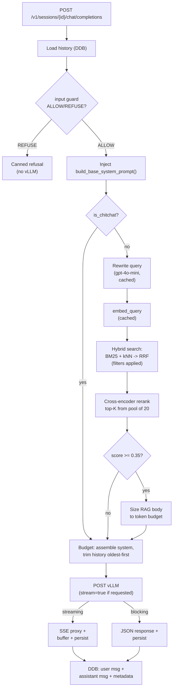

# RAG Architecture

Index for the gateway RAG pipeline in front of vLLM. Each component links to a deep-dive in [`gateway/docs/`](docs/) and the code symbol.

The single RAG kill-switch is `RAG_ENABLED`. Stages fall back internally on failure (hybrid → kNN, rewrite → literal, rerank → un-reranked top-K, cache → miss). Overridable knobs live in [`gateway/app/config.py`](app/config.py) and `kubernetes/gateway-configmap.yaml`.

## TL;DR

- **Two-stage retrieval**: hybrid BM25 + kNN (RRF) → cross-encoder rerank → score-gated top-K
- **Markdown-aware chunking** with YAML-frontmatter metadata
- **Faiss** kNN in OpenSearch (pre-filtering)
- **Conversational query rewriting** for follow-ups
- **Unified token budget** across RAG, history, new turn, and completion
- **One server-controlled system prompt** (base always on; RAG context appended when chunks exist)
- **In-memory LRU caches** for embeddings and search (bust on corpus change + TTL)
- **SSE streaming** with disconnect-resilient persistence
- **Input guard** (`classify_user_intent` in [`app/guard.py`](app/guard.py)) — optional gpt-4o-mini ALLOW/REFUSE before RAG/vLLM; fail-open without `OPENAI_API_KEY`

`POST /v1/sessions/{id}/chat/completions` is the only chat path. `/v1/chat/completions` is 404. Retrieval is not streamed; caches are pod-local; completions are not cached; only `choices[0]` is persisted.

---

## Pipeline (request flow)



---

## Components

### Chunking
- **What**: Markdown split at YAML frontmatter, H1/H2, and `---` separators. Chunks inherit `document`, `category`, `topic`, etc. PDF/TXT use character-based chunking with sentence/paragraph boundary preference.
- **Code**: `chunk_markdown` and `chunk_text` in [`gateway/app/rag.py`](app/rag.py); `process_document_background` in [`gateway/app/documents.py`](app/documents.py).
- **Knobs**: `CHUNK_SIZE` (2000), `CHUNK_OVERLAP` (200) — PDF/TXT and oversized markdown sections.
- **Deep dive**: [`gateway/docs/chunking.md`](docs/chunking.md)

### Embedding & indexing
- **Model**: `BAAI/bge-small-en-v1.5` (384 dims, CPU) via `fastembed`. Pre-downloaded at Docker build.
- **Index**: OpenSearch **Faiss** HNSW (`innerproduct` on L2-normalized vectors).
- **Code**: `embed_texts`, `embed_query`, `OpenSearchRAG.create_index_if_not_exists`, `OpenSearchRAG.index_chunks` in [`gateway/app/rag.py`](app/rag.py).
- **Deep dive**: [`gateway/docs/faiss-migration.md`](docs/faiss-migration.md)

### Hybrid retrieval (BM25 + kNN + RRF)
- **What**: One `msearch`: BM25 `match` on `content` + kNN on `embedding`, fused client-side with RRF. Display scores relative 0–1.
- **Code**: `_hybrid_search` + `_rrf_fuse` in [`gateway/app/rag.py`](app/rag.py).
- **Knobs**: constants `HYBRID_CANDIDATE_POOL=25`, `RRF_K=60`. Falls back to pure kNN on error.
- **Deep dive**: [`gateway/docs/hybrid-search.md`](docs/hybrid-search.md)

### Metadata filtering
- **What**: Optional `rag_filters` on `category`, `topic`, `document_name`. Pydantic `extra="forbid"` + `_FILTERABLE_FIELDS` whitelist. Faiss pre-filters during HNSW.
- **Code**: `_FILTERABLE_FIELDS` + `_build_filter_clauses` in [`gateway/app/rag.py`](app/rag.py); `RagFilters` in [`gateway/app/models.py`](app/models.py).
- **Deep dive**: [`gateway/docs/metadata-filtering.md`](docs/metadata-filtering.md)

### Cross-encoder rerank
- **Model**: `Xenova/ms-marco-MiniLM-L-6-v2` via `fastembed.TextCrossEncoder`. Pre-downloaded at Docker build, pre-loaded in lifespan.
- **What**: Hybrid pool of `RERANK_POOL=20` → rerank → top `RAG_TOP_K`. Scores sigmoid-normalized to `[0, 1]`.
- **Code**: `rerank` in [`gateway/app/rag.py`](app/rag.py).
- **Knobs**: constants `RERANK_MODEL_NAME`, `RERANK_POOL`. Swap requires Dockerfile + rebuild. Falls back to un-reranked top-K on error.
- **Deep dive**: [`gateway/docs/reranker.md`](docs/reranker.md)

### Retrieval gating
- **Two layers**: (1) `is_chitchat` skips rewrite/search/rerank for obvious filler (`hi`, `thanks`); short follow-ups still hit the rewriter when history exists. (2) `RAG_MIN_SCORE=0.35` drops low sigmoid scores post-rerank only (RRF/kNN scales differ).
- **Code**: `is_chitchat`, `_apply_min_score` in [`gateway/app/rag.py`](app/rag.py); orchestrated in [`gateway/app/main.py`](app/main.py).
- **Knobs**: `RAG_MIN_SCORE` (0.35) — the only quality dial.
- **Deep dive**: [`gateway/docs/retrieval-gating.md`](docs/retrieval-gating.md)

### Conversational query rewriting
- **What**: gpt-4o-mini (same OpenAI key as the input guard) rewrites follow-ups into standalone search queries. LRU keyed on `(session_id, history_length, latest_message)`. Falls back to the literal message.
- **When**: prior history, chit-chat gate did not skip, and `OPENAI_API_KEY` is set.
- **Code**: `rewrite_query`, `_QUERY_REWRITE_SYSTEM_PROMPT`, `_query_rewrite_cache` in [`gateway/app/rag.py`](app/rag.py).
- **Deep dive**: [`gateway/docs/query-rewriting.md`](docs/query-rewriting.md)

### Token budgeting
- **What**: One budget for RAG body, history, new turn, and completion. RAG sized to `min(RAG_MAX_CONTEXT_TOKENS, available // 2)`. History trimmed oldest-first.
- **Critical**: `MODEL_CONTEXT_TOKENS` MUST equal vLLM `--max-model-len` (both default `4096`).
- **Code**: `_assemble_messages_for_budget` in [`gateway/app/main.py`](app/main.py); `build_rag_context` in [`gateway/app/rag.py`](app/rag.py).
- **Deep dive**: [`gateway/docs/token-budgeting.md`](docs/token-budgeting.md)

### System prompt normalization
- **What**: At most one `role="system"` at index 0, always server-injected (`build_base_system_prompt`, upgraded to RAG when chunks exist). Client `role: "system"` → HTTP 400. History system rows dropped.
- **Code**: `_merge_system_content` + `_assemble_messages_for_budget` in [`gateway/app/main.py`](app/main.py).
- **Deep dive**: [`gateway/docs/system-prompt-normalization.md`](docs/system-prompt-normalization.md)

### Caching
- **Two LRU caches** (`OrderedDict` + `threading.Lock`): embedding keyed on query (no TTL, size 1024); search keyed on `(query, normalized_filters, top_k)` (size 256, bust on add/delete, TTL 600s).
- **Code**: `_embedding_cache`, `_search_cache`, `_normalize_filters_key`, `bust_search_cache` in [`gateway/app/rag.py`](app/rag.py).
- **Deep dive**: [`gateway/docs/caching.md`](docs/caching.md)

### SSE streaming
- **What**: `"stream": true` on the session endpoint. RAG + budget run first, then `_stream_and_persist` proxies vLLM SSE, buffers `delta.content`, persists on end. Input-guard refusals use `_stream_canned_refusal`.
- **Disconnect**: `metadata.interrupted=true` **and** `\n\n_[response interrupted]_` on the content. Empty buffer → persist nothing.
- **Headers**: `Cache-Control: no-cache`, `X-Accel-Buffering: no`, `Connection: keep-alive`.
- **Code**: `_stream_vllm_completion`, `_stream_and_persist` in [`gateway/app/main.py`](app/main.py).
- **Deep dive**: [`gateway/docs/streaming.md`](docs/streaming.md)

### Sessions & persistence
- **Storage**: DynamoDB conversations (PK `session_id`, SK `message_id`), TTL on `expires_at`. Separate documents-metadata table. Timestamps are aware UTC.
- **History**: `get_session_history_with_token_limit(session_id, max_tokens=...)`.
- **Code**: `SessionManager` in [`gateway/app/session.py`](app/session.py); `DocumentManager` in [`gateway/app/documents.py`](app/documents.py).

---

## Config knob summary

Env vars in [`gateway/app/config.py`](app/config.py); override via the Kubernetes configmap.

### Pipeline feature flag
| Var | Default | Purpose |
| --- | --- | --- |
| `RAG_ENABLED` | `true` | Master kill-switch. Per-stage flags were removed; stages auto-fall back on failure. |

### Retrieval tuning
| Var | Default | Purpose |
| --- | --- | --- |
| `RAG_TOP_K` | 5 | Chunks kept after rerank (before the score floor) |
| `RAG_MIN_SCORE` | 0.35 | Post-rerank floor (sigmoid). The single quality dial. |

### Persona
| Var | Default | Purpose |
| --- | --- | --- |
| `DESIRED_RAG_TOPIC` | `Desired RAG Topic` | Interpolated into the system prompt, input-guard classifier, and canned refusal. |

### Token budgeting
| Var | Default | Notes |
| --- | --- | --- |
| `MODEL_CONTEXT_TOKENS` | 4096 | MUST equal vLLM `--max-model-len` (`kubernetes/configmap.yaml` → `MAX_MODEL_LEN`). |
| `MAX_HISTORY_TOKENS` | 3000 | Hard upper bound on history |

### Internal tunables (not env vars)

Algorithmic / prompt-coupled / pod-local memory bounds.

| Constant | Value | Defined in |
| --- | --- | --- |
| `RERANK_MODEL_NAME` | `Xenova/ms-marco-MiniLM-L-6-v2` | [`gateway/app/rag.py`](app/rag.py) |
| `HYBRID_CANDIDATE_POOL` | 25 | [`gateway/app/rag.py`](app/rag.py) |
| `RRF_K` | 60 | [`gateway/app/rag.py`](app/rag.py) |
| `RERANK_POOL` | 20 | [`gateway/app/rag.py`](app/rag.py) |
| `QUERY_REWRITE_MODEL` | gpt-4o-mini | [`gateway/app/rag.py`](app/rag.py) |
| `QUERY_REWRITE_HISTORY_TURNS` | 4 | [`gateway/app/rag.py`](app/rag.py) |
| `QUERY_REWRITE_MAX_TOKENS` | 64 | [`gateway/app/rag.py`](app/rag.py) |
| `QUERY_REWRITE_TEMPERATURE` | 0.0 | [`gateway/app/rag.py`](app/rag.py) |
| `QUERY_REWRITE_TIMEOUT_SECONDS` | 5.0 | [`gateway/app/rag.py`](app/rag.py) |
| `QUERY_REWRITE_CACHE_SIZE` | 512 | [`gateway/app/rag.py`](app/rag.py) |
| `EMBEDDING_CACHE_SIZE` | 1024 | [`gateway/app/rag.py`](app/rag.py) |
| `SEARCH_CACHE_SIZE` | 256 | [`gateway/app/rag.py`](app/rag.py) |
| `SEARCH_CACHE_TTL_SECONDS` | 600 | [`gateway/app/rag.py`](app/rag.py) |
| `RESERVED_COMPLETION_TOKENS` | 512 | [`gateway/app/main.py`](app/main.py) |
| `RAG_MAX_CONTEXT_TOKENS` | 2500 | [`gateway/app/main.py`](app/main.py) |
| `SYSTEM_PROMPT_OVERHEAD_TOKENS` | 500 | [`gateway/app/main.py`](app/main.py) |

### Infra
`AWS_REGION`, `DYNAMODB_TABLE`, `OPENSEARCH_ENDPOINT`, `OPENSEARCH_INDEX`, `VLLM_INTERNAL_URL`, `VLLM_API_KEY`, `OPENAI_API_KEY`, `INPUT_GUARD_ENABLED`, `DESIRED_RAG_TOPIC`, `SESSION_TTL_HOURS`, `HOST`, `PORT`, `CHUNK_SIZE`, `CHUNK_OVERLAP`.

---

## Operational notes

- **Corpus changes bust the search cache.** `process_document_background` (after index) and `DocumentManager.delete_document` (after delete-by-query) call `bust_search_cache()`.
- **Schema / chunking / embedding changes need a reindex.** Delete the OpenSearch index, restart the gateway (`create_index_if_not_exists`), re-upload with [`scripts/upload-docs.sh`](../scripts/upload-docs.sh).
- **Reranker + embedder are pre-downloaded** in [`gateway/Dockerfile`](Dockerfile) and pre-loaded in the lifespan handler.
- **Streaming** is per-request `"stream": true`. No extra knobs.
- **Guard + rewrite** share `OPENAI_API_KEY` / gpt-4o-mini (sequential POSTs, not vLLM). Empty key skips both.

---

## Open gaps

1. **Observability.** Per-turn logs, no Prometheus `/metrics` (retrieval latency, cache hits, rewrite fallbacks).
2. **Reindex automation.** `scripts/upload-docs.sh` exists; nothing wipes the OpenSearch index first.
3. **Per-tenant isolation.** Documents are global. A server-injected `tenant_id` on `_FILTERABLE_FIELDS` would be the path.
4. **Hybrid score floor.** `RAG_MIN_SCORE` only applies after a successful rerank.
5. **OpenAI burst.** Guard + rewrite share one key; 429s fail-open.

---

## File map

```
gateway/
  RAG_ARCHITECTURE.md        # this file
  app/
    config.py                # overridable env vars
    main.py                  # FastAPI, RAG orchestration, streaming, budget
    rag.py                   # chunking, embedding, search, rerank, cache, rewriter
    guard.py                 # input-guard classifier
    documents.py             # upload pipeline, bust_search_cache
    session.py               # DDB session + history loader
    models.py                # Pydantic, RagFilters
  docs/
    hybrid-search.md
    reranker.md
    chunking.md
    metadata-filtering.md
    faiss-migration.md
    query-rewriting.md
    retrieval-gating.md
    token-budgeting.md
    system-prompt-normalization.md
    caching.md
    streaming.md
```
