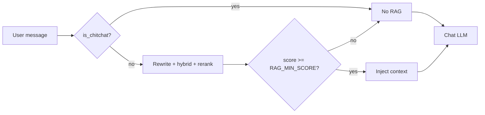

# Retrieval gating

Two gates decide whether RAG runs and which chunks reach the prompt. Always on under `RAG_ENABLED`. [`is_chitchat`](../app/rag.py) / [`_apply_min_score`](../app/rag.py).

The heuristic is a cheap skip. The score floor is the quality net — it can be conservative on false negatives because the floor still drops junk.

## Gate 1: `is_chitchat`

Runs before rewrite/search. Conservative: better to waste a search than skip a real question.

- **Phrase match** (always): whole message, lowercased, trailing punctuation stripped, in `_CHITCHAT_PHRASES` (`hi`, `thanks`, `ok`, `lol`, …). `"thanks"` skips even mid-conversation; `"thanks for that"` does not.
- **Short-message rule** (no history only): ≤2 words, no `?`, doesn't start with a `_QUESTION_LEADS` token (`what`, `how`, `tell`, `list`, …). Suppressed when there's history so `"more please"` / `"what about ice"` still hit the [rewriter](query-rewriting.md).

## Gate 2: `RAG_MIN_SCORE`

After a successful rerank, drop chunks whose sigmoid score is below the floor (default `0.35`). Empty after the floor → no RAG context (same as OpenSearch down).

The floor only runs on sigmoid reranker scores (`[0, 1]`). RRF (~0.01–0.05) and raw kNN are different scales, so a rerank failure / skip leaves the un-reranked top-K ungated. See [reranker.md](reranker.md).

Off-topic questions (`"how's the weather?"`) pass the heuristic, then usually fail the floor. Residual risk: a question that's semantically close to indexed content can still score ≥0.35. That's a prompt / classification problem, not this gate.

## Logs

| Log | Means |
| --- | --- |
| `RAG gate: skipping retrieval for chit-chat: 'thanks'` | Heuristic skip. |
| `RAG gate: dropped N of M candidates below score 0.35` | Floor dropped chunks. N==M → floor may be too strict. |
| `RAG: Injected K/M ...` | Chunks that survived both gates (and the token budget). |

## Knobs

| Knob | Default | Notes |
| --- | --- | --- |
| `RAG_MIN_SCORE` | `0.35` | Only quality dial. Lower (~0.25) if topical questions starve; raise (~0.5) if adjacent-topic chunks leak into answers. |

Phrase list edits go in `_CHITCHAT_PHRASES` in `rag.py`. Don't make the heuristic smarter.
